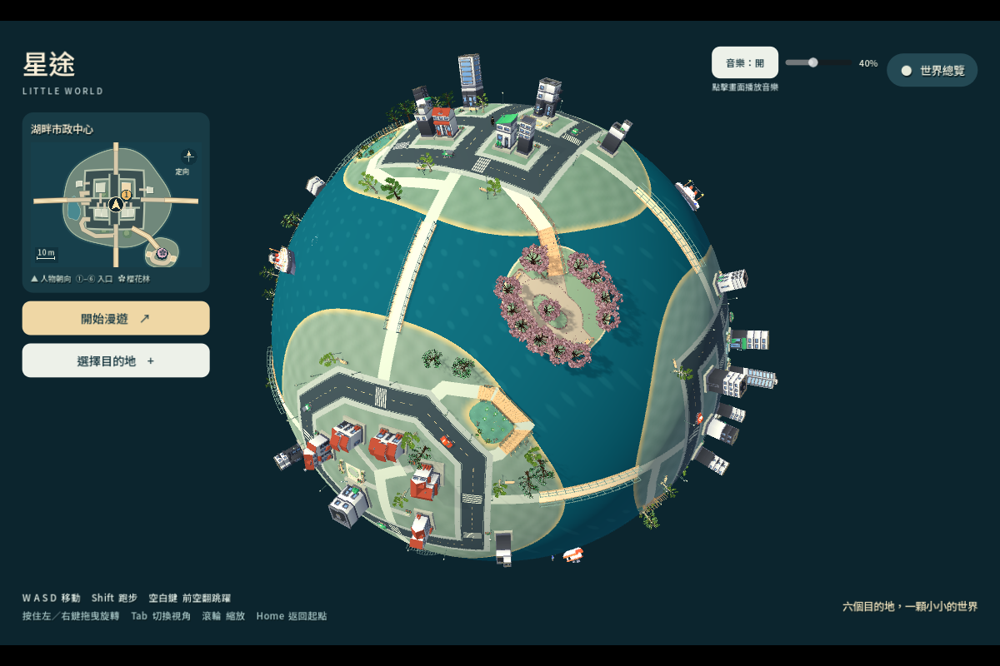
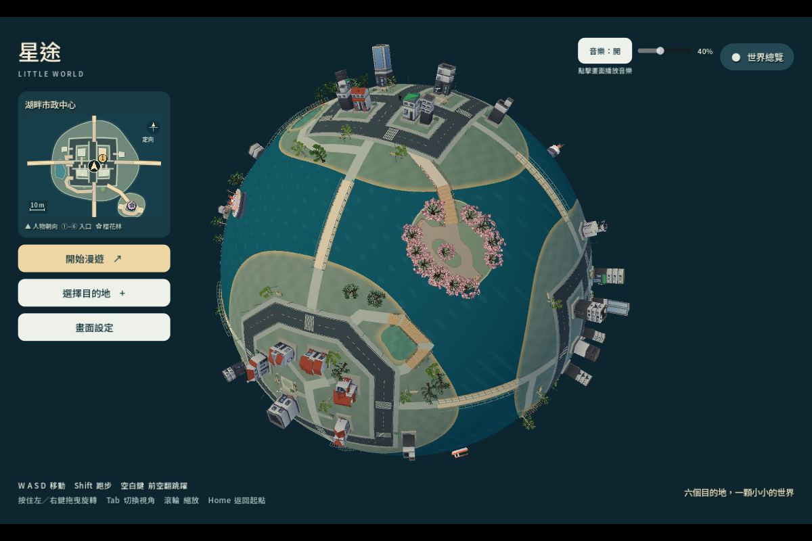
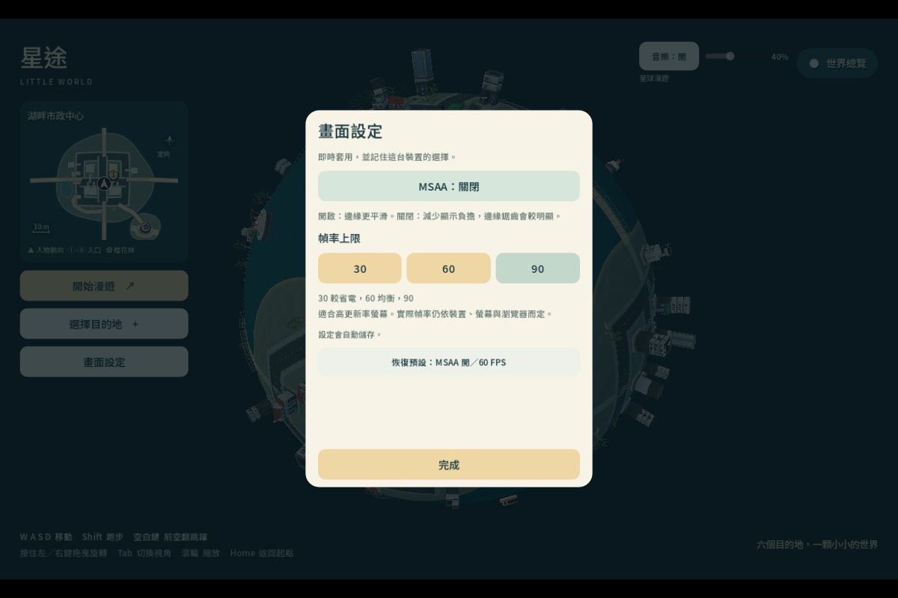

# 「星途 · Little World」效能驗證

日期：2026-10-01。原始基準為本次修改前保存的 `build/performance-before/` 發布檔；新版本以 `_site/` 的實際組裝檔驗證。程式、生成器、生成內容與 Web 發布檔一起交付。依最新要求，驗證僅限本機，不宣稱已驗證 Actions 或公開網站。

實作與參數見 [修改說明](performance-implementation.md)，MSAA／幀率與替代方案見 [畫面設定](performance-antialiasing.md)。可重算的數據見 [performance-measurements.json](performance-measurements.json)。

## 條件與量測界線

- Windows 11，Intel Core i7-1165G7，約 8 GB RAM。瀏覽器 Chrome 154.0.8037.57、headless、1200×800；兩版均為 Intel Iris Xe／ANGLE D3D11 的實際 GPU 路徑，沒有使用 SwiftShader 軟體繪圖。
- 原生視覺／MultiMesh 驗證使用 NVIDIA MX330、Godot 4.7.2 Compatibility；不把這些結果當成 Intel Web 渲染結果。
- 新版本預設 2× MSAA、60 FPS 上限，解析度與貼圖品質未改。舊匯出有 debug telemetry，新匯出是 release；數字比較的是實際交付檔整體，不聲稱單独隔離每項修改的貢獻。
- 同一套瀏覽器腳本、視窗尺寸、初始視角、拖曳／縮放／Tab／Home 路線。每個穩定階段採樣約 8 秒；這是單次本機觀察，未控制其他系統背景活動與長時間溫度，不能當成所有装置的固定 FPS 保證。
- 冷啟動使用新的瀏覽器 context；再次開啟沿用同 context。未清除作業系統與驅動層快取。Resource Timing 證實大 PCK／WASM 仍重新傳輸，所以不能把這輪再次開啟寫成「整包已快取」。JS 則有快取／重新驗證。
- `world_ready` 是場景 `_ready()` 完成的訊號，並非 GPU 第一張畫面完成或首次玩家輸入的精確時刻。報告保留它的名稱，不將其冒充完整可操作時間。
- `process_ms` 是 Godot 整體引擎幀監視器，不能當作純 GDScript profiler CPU 時間。Web release 的 static memory monitor 回傳 0，視為不可取得；JS heap 也不是瀏覽器＋WASM＋GPU 總記憶體。

## 下載量與初始化

| 發布檔 | 原版 | 新版 |
| --- | ---: | ---: |
| PCK | 176,279,832 B | 154,560,308 B |
| WASM | 37,902,138 B | 39,514,754 B |
| PCK＋WASM | 214,181,970 B | 194,075,062 B |

PCK 減少 12.32%，PCK＋WASM 合計減少 9.39%。本次仍將全部分區細節放入同一 PCK，沒有網路按需下載；離線場景替換與匯出排除重複完整場景才影響下載量。保留 `all_resources` 的其他資產，避免漏掉動態引用的角色、音樂或室內功能。

固定路線那輪的 localhost Resource Timing：

| 傳輸時間 | 原版冷／再次開啟 | 新版冷／再次開啟 |
| --- | ---: | ---: |
| PCK | 1.144／2.780 秒 | 1.005／0.764 秒 |
| WASM | 0.810／0.669 秒 | 0.453／0.415 秒 |

兩版大檔在再次開啟仍重新傳輸，沒有測得完整 PCK 的磁碟快取命中。**localhost 傳輸不能推論 GitHub Pages 的網路速度**。原版下載結束到 `world_ready` 約 38.06 秒，新版約 8.96 秒；再次開啟分別約 35.36 與 5.93 秒。這證明原版場景初始化成本明顯，不應將等待全部歸因於下載。

另外以同一個原生 headless 引擎讀取兩版 PCK，載入／instantiate／ready 分別由 **2767／1338／6422 ms** 變為 **713／272／1455 ms**。這是無 GPU 畫面的引擎初始化診斷，不能取代瀏覽器可操作時間。

為避免把 `world_ready` 誤當成可操作時間，另外以 Chrome **154.0.8037.58**、同一 viewport／GPU，依序補測兩版。這輪還記錄 ready 之後第一個 rAF callback 實際恢復執行的時間：

| 啟動補測（從開始導航計時） | 原版冷／再次開啟 | 新版冷／再次開啟 |
| --- | ---: | ---: |
| `world_ready` | 7.03／8.16 秒 | 6.58／4.64 秒 |
| ready 後第一個瀏覽器畫面回呼 | 48.94／55.24 秒 | 35.73／5.97 秒 |
| 下載結束到該畫面回呼 | 47.95／54.20 秒 | 34.77／4.80 秒 |

補測的 ready 時間與先前固定路線差異很大，顯示單次結果受執行環境／暖機狀態影響；不能把 38.06 → 8.96 秒當作穩定的初始化改善倍率。新版冷啟動 **仍等到約 35.73 秒才有此回呼**，並沒有消除首次畫面等待。ready 之後還有顯著工作，未以 profiler 分離其 CPU／GPU／驅動成本。rAF callback 也不是實體螢幕完成呈現或首次輸入反應的精確量測；這兩項仍未量測。補測與固定路線的原始數字均保留，不挑選較好的那次代替其他結果。

## 持續渲染與切換

下表為瀏覽器 rAF 間隔中位數／P95（ms），不是把 FPS 倒數推算為幀時間。

| 同路線階段 | 原版中位數／P95 | 新版中位數／P95 |
| --- | ---: | ---: |
| 全景停留 | 1113.6／1546.3 | 49.7／66.5 |
| 全景旋轉／縮放 | 197.6／814.2 | 49.9／66.6 |
| 近景停留 | 166.5／696.1 | 49.9／66.5 |
| 近景快速轉向 | 182.5／632.4 | 49.9／66.5 |
| Home 傳送後停留 | 620.6／697.8 | 49.9／66.6 |

Godot FPS 採樣中位數，原全景／近景為 1.5／5，新版為 27／18。引擎 FPS 採樣與瀏覽器 rAF 的時間窗不同，不能互相硬換算。新版固定路線仍未穩定達到 30 FPS，更不保證 60 或 90；設定中的 30／60／90 是上限。

新版切近景的 9 秒過渡窗口，最長 rAF 間隔 **349.1 ms**；Home 過渡窗口 **199.4 ms**。仍存在可感知的短暫停頓，不能宣稱切換完全無卡頓。原版未獨立保存相同過渡窗口，該項前後差值**未量測**。新版單個 load／instantiate／登記索引操作的監視器最大值為 **15.8 ms**；整體幀還包含其他工作與 GPU 成本，不能用此數字代替上述過渡幀時間。

新版固定視角最後一筆監視器：

| 指標 | 全景 | 近景 |
| --- | ---: | ---: |
| Draw calls | 511 | 384 |
| 引擎 process monitor | 57.2 ms | 59.3 ms |
| Physics monitor | 0.8 ms | 0.8 ms |
| 節點数 | 1245 | 1623 |
| 完整六區中已就緒數 | 0 | 1 |
| 細節 chunks | 0 | 23 |

海洋演員／櫻花有獨立 region，因此 region 數與六個 district 數不同。舊版沒有記錄相同 Web draw calls、純脚本 CPU、GPU 分項；**未量測**，不拿 headless 的 0 draw calls 當作比較值。完整逐階段資料、遮擋候選與判定耗時仍保存在 JSON。

全景遮擋判定 0 次、候選 0，沒有掃描全部植被。正常近景固定視角的候選可能是 0，這表示該視線沒有候選，不代表没有執行判定；另以真實生成 `alder_0` 的兩個 bark/leaves MultiMesh 測得 3 個候選，完成樹冠內隱藏、快速旋轉重算與原始矩陣恢復驗證。昂貴判定每 0.1 秒一次，淡出插值／相機仍逐幀。

## 常駐記憶體與反覆進出

以相同原生 headless PCK 路線比較：全景 `MEMORY_STATIC` 由 **357,953,549 B** 降為 **330,140,530 B**；節點由 **2610** 降為 **1246**。記憶體降幅約 7.77%，不是隨節點數等比例降低，因為角色、音樂、常駐地形／碰撞與共享資源仍保留。

新版三次進入 counseling，再回到遠全景並等待 10 秒：

| 次數 | 卸載後 nodes | 高細節 chunks | MEMORY_STATIC |
| --- | ---: | ---: | ---: |
| 1 | 1250 | 0 | 335,506,218 B |
| 2 | 1250 | 0 | 335,513,334 B |
| 3 | 1250 | 0 | 335,520,406 B |

節點沒有逐次累加；這三輪靜態記憶體增加 14,188 B，採樣報告陣列本身也持續累積，因此不能由這段數據保證永遠零洩漏。獨立串流 fixture 的四輪載入／卸載也回到相同節點基準，保存的動畫資料只有數值、沒有 Node／Resource 參照。首次互動後多出的常駐節點與逐次串流洩漏要分開看。

另一次實際 Web 功能路線的三次卸載後，nodes 均為 **1250**、objects **3926**、resources **939**、render buffers **141,311,050 B**，高細節 chunks 均為 0。不過 Chrome 的 used JS heap 依次為 **216,130,765／226,136,762／233,333,105 B**，確實上升；未做 GC 或 allocator 分析，不能宣稱瀏覽器整體記憶體完全不增或已證明零洩漏。這輪是在六區與室內操作之後的功能驗收，不與上面的 headless static memory 混用。

完整瀏覽器／WASM／GPU 常駐 RAM、原生 Android／iOS／macOS、真手機耗電與記憶體限制均**未量測**；本次實機只有 Windows。390px viewport 是桌面瀏覽器的版面驗證，不是手機效能驗證。

## 功能與外觀驗證

- 生成結構／依賴：2,581 項通過；86 chunks、2 bases，無過時 chunks，無全景對完整原始地區的隱性相依。
- 完整世界：123 項通過，含六區入口、真實跨區與櫻花橋步行、濕地、海岸、車流、整球移動與地面碰撞。
- 椅子：268 項通過，操作全部 34 張椅子。
- 鏡頭：55 項小型渲染 fixture 與 26 項真實場景檢查通過，包括建築、真實樹木、MultiMesh 原資料恢復與快速轉向。
- 串流生命週期：31 項通過，含距離遲滯、延遲卸載、取消待建立區塊、動畫恢復、反覆載入與 396 個橋梁／道路支撐採樣點。
- 設定：34 項 fixture 通過，包含儲存、非法值、儲存失敗、控制恢復與三種視窗尺寸。
- 最終 `_site/` 的 localhost 真實滑鼠／鍵盤操作：**37 項通過、errors 為空**，涵蓋 MSAA 與三種幀率、重新載入後保存、六區傳送／入口互動、訓練室移動至出口再返回、快速鏡頭、步行、旋轉縮放及三次卸載。這輪 Chrome 已自動更新至 **154.0.8037.58**，功能數據不併入前面的 .57 效能比較。
- Web 的 12 秒步行測試被花盆阻擋，只移動 5.70 m，沒有穿過區域邊界；**Web 徒步跨區未量測**，不能把六區傳送冒充徒步跨區。原生完整世界檢查另有實際跨區步行。
- 直接使用新 PCK 跑六區互動與室內往返，檢查通過；明確釋放測試世界後，verbose log 無錯誤、警告或退出洩漏。
- 打包：manifest／各分片／組裝 PCK SHA-256 一致，並測試損壞分片會拒絕組裝、過時分片清理不刪除未列入 manifest 的檔案。

全景輸入靜態幾何 2,118,820 triangles，最終簡化／合併後 1,009,913 triangles、893,393 vertices；這不是整個遊戲所有角色與動畫的總面數。316 個貼地／道路／水岸網格保留來源幾何。早期缺口已以同工作區對照修正，194 個地表網格的三角數、面中心與邊中點半徑與保護後輸入一致。

原發布檔全景：

最終發布檔全景，太陽即時陰影已關閉：

實際 Web 畫面設定（圖中暫選 90／MSAA 關閉；測試結束已還原 60／MSAA 開啟）：

## 重現與發布狀態

原始證據與 log 保留於 `deliverables/performance/`（未提交大量本機中間產物）；精簡測量 JSON 與對照圖已提交。使用 `tools/measure_web_performance.cjs` 重跑固定路線，`tools/check_performance_browser.cjs` 重跑實際 UI，`tools/summarize_performance.py` 重新產生數據摘要。Playwright 使用既有本機依賴，不新增服務。

發布檔 `deploy/github-pages/files/index.release.json` 記錄 build ID **streaming-3f7c73f0246b34c7**。同次匯出的 HTML、JS、WASM、PCK 已於本機組裝並測試。PCK SHA-256：`5210d188c2b2214b0f2d6f0e88814dd0fb4b18957c8509a1b18c2e7a56db0961`。

原有 workflow 只組裝發布檔，不執行 Godot。GitHub 部分按本次最後指示執行提交、推送；Actions 結果與實際公開網站版本未驗證。
